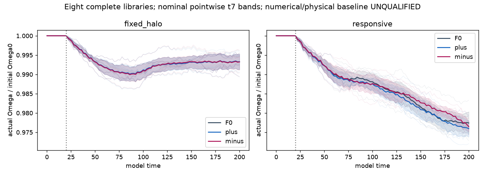
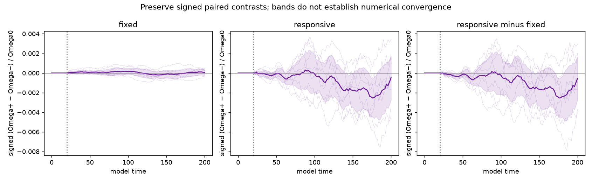
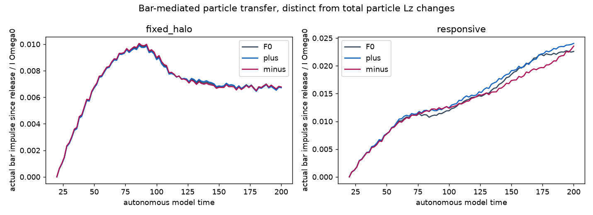
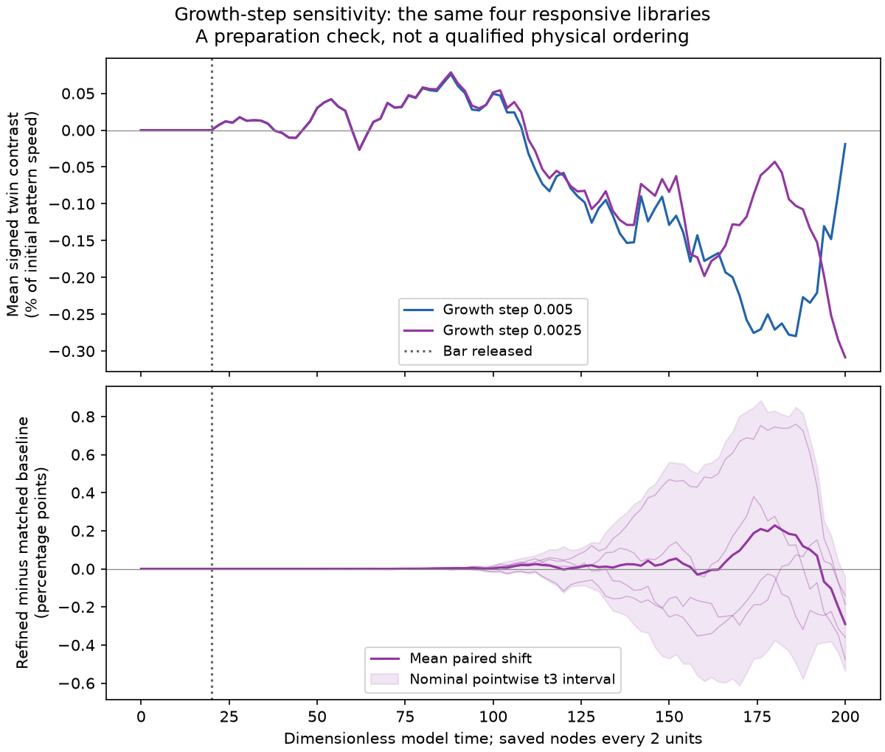
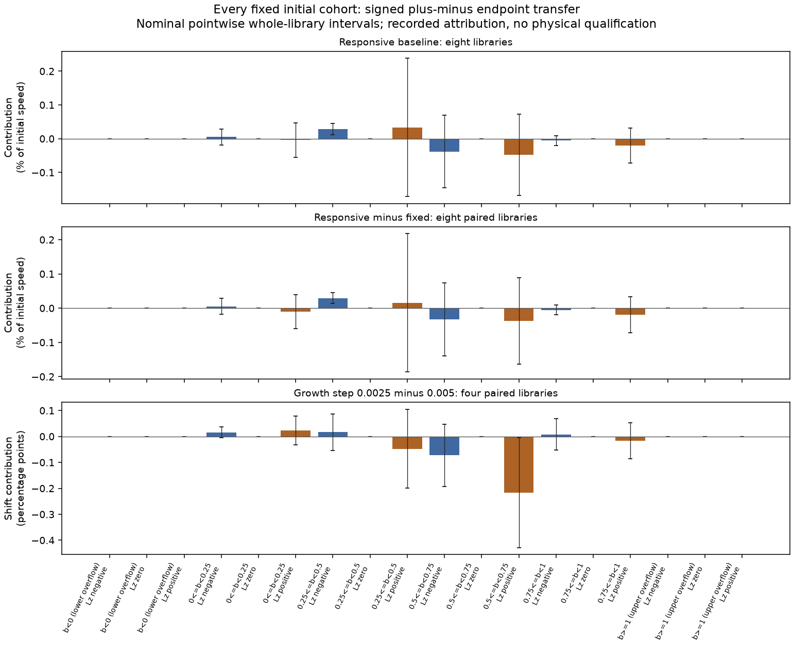

# Unresolved autonomous bar response under matched halo properties

*Draft follow-up, 6 October 2026. Baseline and growth-step readouts and the individual-library scalar export are complete. Publication delivery is tracked separately from numerical evidence.*

The complete eight-library experiment does not resolve which of two matched halo populations brakes an autonomous rigid bar more at the preselected endpoint. The populations share unusually strong initial constraints, but their mean signed pattern-speed separation has a nominal sampling interval containing zero. Halving the preparation timestep also fails the declared relative numerical-tolerance test. The recorded baseline exchange checks pass; numerical accuracy and the physical interpretation remain unqualified. This outcome limits the autonomous claim without turning it into a physical null or a continuum upper bound.

The distinction between the analytical construction and this dynamical test matters. For the spherical continuum family, write \(F_\pm=F_0\pm\delta F\), where \(\delta F(\mathbf x,-\mathbf v)=-\delta F(\mathbf x,\mathbf v)\). Reversal parity gives the same density and complete velocity-reversal-even distribution. The specific construction also cancels the local first velocity moment, giving zero mean streaming at every position while retaining higher odd structure. These are exact initial identities. Earlier comparisons in a common imposed bar field demonstrate how orbital populations can differ in response despite such matching; the force and bar history in that comparison are population-independent. They do not predict the magnitude or sign of a later autonomous difference. The [short-time derivation](SHORT_TIME_RESPONSE.md) likewise concerns the initial response under its stated continuum assumptions, rather than the endpoint measured here.

The present experiment allows the particles to torque a positive-density rigid bar and, in the responsive treatment, to change their own represented gravitational field. Each population therefore develops its own halo field and rotor history. Even the fixed spherical-background comparator has population-dependent autonomous bar histories. Common imposed-field population averaging cannot be applied to those different trajectories. The evolution is collisionless, with neither a SIDM collision operator nor imposed action diffusion. The bar remains fixed in centre and axis, with imposed shape growth and axial rotation; it is not a live stellar disc.

In model units \(G=M_{\rm tot}=a=1\), the bar has mass \(0.1\), axial inertia \(I_b=0.1\) and initial angular speed \(\Omega_0=0.5946035575\) in inverse model time. Its speed is held during growth through \(t=20\), then released through the preselected endpoint \(T=200\). Eight independent randomized initial libraries each supply the paired reference, plus and minus populations in both fixed-background and responsive treatments: **48 authenticated population histories**. Release and endpoint states and full particle-transfer records are retained. The independent sampling unit is a complete library; populations, time nodes and trajectory continuations do not increase that count.

The primary measurement is

\[
C_i(200)=\frac{\Omega_{+,i}(200)-\Omega_{-,i}(200)}{\Omega_0},
\qquad
\bar C=\frac{1}{8}\sum_{i=1}^{8}C_i.
\]

For the responsive treatment, \(\bar C=-0.0004926756603\), with nominal pointwise 95% Student-\(t_7\) interval \([-0.0027249347104,\,+0.0017395833898]\). The mean separation is \(-0.0493\%\) of the initial speed, with nominal interval \([-0.2725\%,\,+0.1740\%]\). These are signed paired measurements in the stated model, not averages of absolute library contrasts. The secondary trapezoidal mean on the recorded nodes over \(180\le t\le200\) also has an interval containing zero. Neither interval includes a completed numerical-error allowance or supplies calibrated simultaneous coverage. The [baseline summary](evidence/results.json) preserves the reported means, intervals and exchange ratios. The [packet evidence package](README.md) additionally supplies all eight individual-library scalar histories and the same-four growth comparison. Its executed arithmetic reader reconstructs all 36 published comparisons; it does not rerun trajectories or establish numerical accuracy.

The [frozen response policy](POLICY.json) expands the primary interval by nonnegative allowances from five numerical challenges and a corrected angular-momentum residual. Such expansion cannot remove the zero already inside the baseline interval. The fixed ensemble therefore cannot establish the policy's sign-supported ordering or its ten-percent prioritization target. This does not show that hidden orbital structure is dynamically irrelevant, nor does absence of a supported sign bound its continuum effect.

All sixteen required responsive plus/minus baseline paths satisfy the three recorded-node exchange inequalities over \(20\le t\le200\): energy residual relative to actual rotor kinetic-energy exchange, corrected vector angular-momentum residual relative to actual bar impulse, and rotor–halo exchange residual relative to that impulse. Their denominators are nonzero; the largest energy ratio is \(1.963\times10^{-5}\), below the declared \(0.01\) ceiling. The vector and rotor ratios are below \(5.2\times10^{-13}\). These checks test exchange accounting at the saved nodes. Small residuals cannot establish accurate forces or trajectories. The full refinement assessment remains incomplete, and the finite populations' unforced evolution has not established continuum stationarity or stability. See the [baseline assessment](#the-endpoint-is-sensitive-to-the-preparation-timestep) and [preparation assessment](#the-endpoint-is-sensitive-to-the-preparation-timestep).

Distribution-function sensitivity has clear predecessors. [Chiba & Kataria (arXiv:2311.07640v2)](https://arxiv.org/html/2311.07640v2) examine reversal-odd populations and equal-spin changes in distribution steepness. [Kataria & Shen (arXiv:2406.17113v1)](https://arxiv.org/html/2406.17113v1) find different live-bar histories at fixed nonzero spin, alongside similar evolution in their tested zero-spin cases. Our proposed distinction concerns simultaneous pointwise zero streaming and complete reversal-even matching. The present unresolved autonomous result does not yet establish that stronger dynamical contribution.

Matching the initial density and choosing mass, length or rotation-curve scales specifies a controlled input. It does not validate a prediction against a galaxy. The rotor's structural scale is not an observed stellar-bar semi-major axis, and its angular speed is not a stellar-light pattern-speed estimate. This model has no evolving stellar bar length, light amplitude or stellar heating prediction. An observational comparison would require those independent dynamical outputs and a matched projection and measurement procedure, as set out in the [observational contract](OBSERVATIONAL_CONTRACT.md).

## The endpoint is sensitive to the preparation timestep

The completed joined growth readout authenticates all twelve refined histories and compares them with the **same first four** baseline libraries. It changes the clamped growth timestep from 0.005 to 0.0025 while keeping the growth duration of 20, free timestep of 0.04, physical parameters and endpoint fixed. The three missing minus tails completed full-support restart verification and continuation; their original partial records remain partial. This comparison tests numerical preparation sensitivity, rather than a different physical bar-growth history.

At \(T=200\), the mean paired refined-minus-baseline shift in signed responsive contrast is \(-0.0028962153971\), with nominal pointwise 95% \(t_3\) interval \([-0.0053782728960,\,-0.0004141578982]\). The negative shift is nominally resolved across these four paired libraries. The physical ordering remains unresolved: the same-four baseline mean is \(-0.0001884919411\) and the refined mean is \(-0.0030847073382\), and both nominal intervals contain zero. Pairing can resolve a change in the calculation while leaving the physical twin contrast unresolved.

The [frozen policy](POLICY.json) assigns this numerical arm an allowance equal to the largest absolute endpoint of its shift interval, \(0.0053782728960\). That single allowance exceeds the permitted total numerical share, \(0.2|\bar C|=0.0000985351321\), so the primary condition necessarily fails the magnitude test as well as the sign test. This is a descriptive refinement proxy, not a bound on the true discretization error. Small exchange residuals cannot override this sensitivity.

The secondary recorded-node mean over \(180\le t\le200\) has a paired shift of \(+0.0004528623108\), with nominal interval \([-0.0041134190607,\,+0.0050191436823]\). This different behavior preserves uncertainty about the late histories; it cannot replace the preselected endpoint or identify a mechanism. The [growth summary](evidence/results.json) retains the computed comparisons and actual exchange ratios. Missing free-step, particle-number, basis and angular-order controls remain missing, and the full matrix remains unfunded. Their nonnegative allowances cannot reverse either necessary failure; none is assigned zero.

## Captions for the existing baseline figures

**Figure 1 — Pattern-speed histories (`autonomous-pattern-histories.png`).** Fixed spherical-background and responsive-halo treatments are shown separately. Gray, blue and magenta denote reference, plus and minus populations. Faint curves show the eight library histories; solid curves show their means; shading shows nominal pointwise 95% \(t_7\) sampling intervals. Speed is normalized by the common initial \(\Omega_0\); the dotted line marks release at model time 20. The bands do not qualify numerical accuracy.

**Figure 2 — Signed paired contrast (`signed-paired-contrast.png`).** Panels show \(C(t)=(\Omega_+-\Omega_-)/\Omega_0\) in the fixed background, the responsive halo, and their difference formed within each library. Faint curves retain all eight paired contrasts; solid curves and shading give the mean and nominal pointwise 95% \(t_7\) interval. Horizontal zero and the release marker orient the comparison. The right panel is descriptive: neither its refinements nor a collective-amplification interpretation are qualified.

**Figure 3 — Accumulated bar-mediated transfer (`postrelease-bar-transfer.png`).** Curves show the eight-library mean halo angular impulse from the bar since each population's own release, divided by \(I_b\Omega_0\), for the fixed-background and responsive treatments. Pre-release values are omitted. These are mean curves without sampling bands, and the transfer is distinct from total particle angular-momentum change. Its relation to rotor slowing is an exchange identity, not an independent confirmation of the twin contrast or evidence of resonant capture.

**Figure 4 — Preparation-step sensitivity (`growth-step-sensitivity.png`).** The first panel compares the responsive signed contrast for the same four initial libraries at baseline and refined preparation steps. The second shows their within-library refined-minus-baseline differences. The plotted means and nominal pointwise \(t_3\) bands use actual recorded nodes. Physical duration, free step and endpoint are unchanged; the release states can differ. The endpoint sensitivity is not a physical population ordering or a convergence bound.

[Interactive version](https://djova.ca/galaxy-bar/autonomous-bar.html) requires the public website. All static figure copies and scalar operands are included beside this mirrored text.

## Initial-cohort attribution: all support retained

A separately predeclared diagnostic partitions the initial particles by six
construction-binding-energy bands and the sign of their initial axial angular
momentum. All 60 baseline/refined full-particle transfer records retain each
population's own physical mass and release prefix. The 18 cell contributions
sum to the saved signed endpoint contrast; their full cross-cell covariance
recovers its whole-library sampling uncertainty. This identity verifies
accounting, rather than providing independent dynamical evidence.

The responsive cohort means contain positive and negative contributions. Their
signed sum is −0.0004926756603; the sum of their absolute means is
0.0018174845674. The growth-shift figure shows sensitivity distributed across
initial populations, with its largest negative mean in the positive-Lz,
0.5 ≤ b < 0.75 cell. All cells are shown, including empty bins. These initial
labels do not establish resonant capture or a converged physical mechanism.

**Figure 5.** Fixed endpoint T = 200, independent of the interactive clock.
Panels show the responsive baseline, paired responsive-minus-fixed comparison,
and same-four growth-step shift. All preselected bins retain their own masses.
Intervals are nominal pointwise t7/t3 summaries, without simultaneous coverage
or numerical bounds. The [complete cell results](evidence/cohorts/cohort-results.json)
include library vectors and covariance; the [population operands](evidence/cohorts/cohort-population-operands.csv)
include counts, masses and bar impulses. The [cohort manifest](evidence/cohorts/cohort-manifest.json)
pins current product/source bytes. Parent readers lacked historical
per-particle output hashes; the new meter validates current IDs, masses,
ancestry and aggregate closure, not an independent reconstruction of kicks.

This diagnostic leaves both necessary qualification failures unchanged. The
remaining matched controls and live stellar extension remain unfinished. It
does not establish a physical null or a continuum upper bound.
