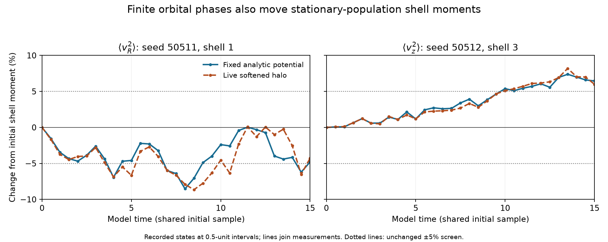

# Checks behind the early hidden-dynamics results

Checkpoint **discovery-2026-10-01.4**. These controls concern the exploratory
campaign, not a revision of the canonical population-response paper. The
prescribed-field results remain unchanged. No live bar, self-consistent core,
finite stellar selectivity ratio or observational validation is established.

An instantaneous shell average need not be stationary in a finite sample of an
equilibrium distribution. A computed gravitational field can fail a known zero
because its phase-space integral is under-resolved. A small heating mean can be
carried by only a few sampled trajectories. The controls below distinguish these
limits before assigning a physical interpretation.

[Interactive website](https://djova.ca/galaxy-bar/discovery-controls.html) — the
population selectors require that website. [Static numerical values](data/checks-v1.json)
and the methods below are available directly in this mirror. Reading them
launches no calculation. The [earlier findings](REPORT.md) and
[release manifest](manifest.json) identify the separate response experiments.

## Stationary orbital phases move finite-sample shell moments

The original live quiet screen uses two 16,384-position samples and three halo
populations. All nine coarse/fine cases now pass their frozen numerical checks.
All six coarse histories retain their original 5% shell-moment adjustment flags.
The new control advances exactly those samples in their stationary unsoftened
construction potential,

\[
\Phi_0(r)=-[0.5+\sqrt{0.25+r^2}]^{-1},\qquad G=M_0=1.
\]

Every initial mass, position, orbital action, velocity sign and shell boundary is
preserved. Canonical angles advance at the analytic frequencies; they are not
replaced by the geometric particle azimuth. The 31 saved states use model times
0, 0.5, …, 15. The instantaneous observable is

\[
100\left[\frac{\langle v_k^2\rangle_{\rm shell}(t)}
{\langle v_k^2\rangle_{\rm shell}(0)}-1\right].
\]



**DISC-CHECK-PHASE-01/02.** Both panels use the shell/component giving the
original F0 live maximum, selected after that screen. Blue is the analytic
field; dashed orange is the live softened halo. Markers are the recorded states;
lines connect measurements. The original ±5% threshold remains visible.
The website also selects the corresponding F+ and F− recorded views. These
selected panels do not replace the complete all-shell comparisons.

Every analytic history also crosses the old screen. Its absolute maxima range
from 7.11% to 8.59%, versus live maxima of 7.67% to 9.64%. At the six live
extrema, the paired values are:

| Draw | Population | Live change | Analytic change at that live extremum | Live minus analytic / initial |
| --- | --- | ---: | ---: | ---: |
| 50511 | F0 | −8.653% | −7.065% | −1.587 percentage points |
| 50511 | F+ | −9.642% | −7.142% | −2.500 percentage points |
| 50511 | F− | −7.666% | −6.193% | −1.473 percentage points |
| 50512 | F0 | +8.197% | +7.380% | +0.818 percentage points |
| 50512 | F+ | +8.203% | +7.075% | +1.128 percentage points |
| 50512 | F− | +8.421% | +7.546% | +0.874 percentage points |

The maximum absolute paired residual over all covered shells and times remains
3.62–5.53 percentage points. The fixed and live Hamiltonians differ: this
residual combines force-law mismatch, discreteness, force approximation and
possible collective evolution. It does not uniquely attribute them.

A finite instantaneous shell average can cross a threshold without a collective
instability. These exact draws demonstrate that ambiguity, not a calibrated
false-positive rate. The original live flags are not relabelled. Mapping checks
and the selected independent Cartesian paths pass, but neither numerical
qualification nor this fixed-field comparison proves softened equilibrium or
live stability.

The separate [formation restriction](research/discovery-20261001/TWINS_FORMATION_RESTRICTION.md)
shows why present admissibility is not a demonstrated evolutionary history.
Known collisionless Casimir conservation prevents an exact transition from the
exact smooth reference F0 to either exact constructed twin. A different
progenitor, unresolved fine structure or an approximately matched final state
is outside that exclusion.

## Warm stellar heating remains statistically unresolved

The 512-state finite-pulse pilot retains the intended analytic warm population
and exact full-support proposal weights. Its energy units are G = M_h = a_h = 1;
the gas cycle lasts 80 Hernquist reference time units. The fine-step paired
positive estimator subtracts the unforced value. It includes the forward
curvature term and the inverse capture term; zero observed captures do not
justify removing the latter from the operator.

| Declared stellar cohort | Carrier | Paired specific energy mean | Empirical IID SE | Relative SE |
| --- | ---: | ---: | ---: | ---: |
| Whole, mass 1 | 5 | 1.369274e−7 | 7.310620e−8 | 53.39% |
| Whole, mass 1 | 8 | 1.056872e−7 | 6.208151e−8 | 58.74% |
| Guiding Rc < 0.25 | 5 | 5.145907e−6 | 2.758843e−6 | 53.61% |
| Guiding Rc < 0.25 | 8 | 3.988340e−6 | 2.342785e−6 | 58.74% |

The exact inner cohort mass is 0.026499021160743902. It is not replaced by a
noisy measured mass. Every principal precision test exceeds its frozen 30%
allowance. Negative, underflow and tiny-weight states remain in the arrays.

For the whole population, the largest single absolute contributor carries
42.73% at carrier 5 and 52.96% at carrier 8. The largest five carry 96.70% and
97.45%; the heat ESS values are 3.49 and 2.89. These are descriptive sample
concentration measures, not effective independent experiments or tail bounds.
An exact-flow finite-variance argument does not certify useful precision for
this small sample or reliable sqrt(N) cost extrapolation.

The original pilot also fails its independent radial-versus-Cartesian reference
allowance. A separately frozen tighter reference retains all eight originally
selected paths, including the two difficult zero/tiny-weight states. It reduces
the maximum scaled momentum disagreement from 6.07e−7 to 3.51e−9 and passes all
its frozen checks. This locates a numerical contribution to the old reference
mismatch. It does not change the historical failed pilot or repair its
sampling precision. No finite star/halo heating ratio is qualified.

The target is described in [population equivalence](methods/control-checks/FEEDBACK_CUSP_WARM_POPULATION_EQUIVALENCE.md),
[variance assumptions](methods/control-checks/FEEDBACK_CUSP_WARM_VARIANCE_PROOF.md),
the [pilot protocol](methods/control-checks/FEEDBACK_CUSP_WARM_PILOT_PROTOCOL.md)
and [tighter-reference protocol](methods/control-checks/FEEDBACK_CUSP_WARM_REFERENCE_PROTOCOL.md).

## Spatial echo quadrature fails an exact-zero instant

The positive-source pulses have shape harmonics (ell,m) = (2,2) and then (4,4),
with common positive monopoles. The readout is only the complex (2,2) field in an
annulus around radius one. Its four shape-sign cases use weights
(+1, −1, −1, +1)/4. The cohort has absolute mass 0.952162896372471; no case is
renormalized separately.

At isochrone time t = tau = 16, immediately after pulse B, positions have not yet
responded to its velocity impulse. The field term requiring both shapes must
therefore be exactly zero. The original nine predefined refinements all fail their full
complex-field zero gate, even though eight refined rows pass the unforced mass
gate and every row passes mixed-mass and mapper checks.

| Fixed row | Im potential | Im radial force | Re tangential force | Combined zero gate |
| --- | ---: | ---: | ---: | --- |
| baseline_regression | +9.807545562e−9 | +2.074644269e−8 | +2.011560138e−8 | Fail |
| energy_uniform64 | +1.196314002e−9 | −5.167764717e−10 | +2.396917617e−9 | Fail |
| energy_split88 | +8.346474871e−10 | −1.121479545e−8 | +1.459732343e−9 | Fail |
| energy_split176 | −9.097056413e−10 | +1.382365698e−9 | −1.805450516e−9 | Fail |
| L8 | +9.312198103e−10 | −1.025128141e−8 | +1.672257005e−9 | Fail |
| radial32 | +9.155853354e−10 | −1.228773418e−8 | +1.599975634e−9 | Fail |
| inclination12 | +8.346472090e−10 | −1.121479531e−8 | +1.459731787e−9 | Fail |
| apsidal24 | +8.346687128e−10 | −1.121463699e−8 | +1.459778115e−9 | Fail |
| node32 | +8.346648051e−10 | −1.121462251e−8 | +1.459770530e−9 | Fail |

The full complex allowances are 3.341803570152769e−10 for potential,
1.128462275769936e−9 for radial force and 6.760514915717661e−10 for tangential
force. The suppressed symmetry components, retained in the JSON, do not alter
the decisions. A small radial residual alone cannot qualify a row whose other
components fail.

In the original nine-row diagnosis, energy/taper refinement fixes the unforced
mass integral but leaves unstable
signed fields. Partitioned energy doubling changes the radial coefficient by
about 1.26e−8 and reverses the potential/tangential signs. Angular-momentum and
radial-phase refinements also matter; orientation changes are much smaller on
this specified grid. This is unresolved integration error, not a measured late
spatial echo. The failed zero value is not subtracted from a future curve.
The controlled radial-cohort memory result remains a separate calculation.

Read the [frozen nine-direction protocol](methods/control-checks/ECHO_FINITE_DIAGNOSTIC_COMPLETION02_PROTOCOL.md).
There is no self-gravitating halo or stellar response in this spatial screen.

### A separate energy-only continuation passes the instantaneous prerequisite

The [separate frozen energy-pair protocol](methods/control-checks/ECHO_FINITE_ENERGY_PAIR_PROTOCOL.md) holds the non-energy counts and physical
forcing fixed while doubling partitioned energy nodes to 352 and 704. Both
rows pass the full complex zero, mass, mixed-mass and mapper gates:

| New fixed row | Im potential | Im radial force | Re tangential force | Combined zero gate |
| --- | ---: | ---: | ---: | --- |
| energy_split352 | +2.539262914e−11 | +4.212992493e−10 | +5.896782632e−11 | Pass |
| energy_split704 | −4.469600e−11 | +2.477010e−10 | −8.548010e−11 | Pass |

The between-row signed changes are approximately 2.10%, 1.54% and 2.14% of
the previously saved leading potential, radial-force and tangential-force
peaks. Potential and tangential residuals change sign. This threshold pass is
an improved instantaneous numerical prerequisite, not a qualified late finite
spatial echo or full prediction-convergence result. Joint angular-momentum and
radial-phase refinement, late finite-amplitude controls and stellar readout
remain untested. The original nine failed rows are retained unchanged in
[the same data record](data/checks-v1.json), under a separate continuation key.

## Reading, saved arithmetic and source inspection

The [control JSON](data/checks-v1.json) contains the complete six phase curves,
six all-shell summaries, four principal heating rows, eight tighter references,
nine original plus two later full complex sign-case rows and the mass ladder. The
[operand guide](operands/checks-v1/README.md) defines the supplied saved profiles
and two warm-response arrays. A NumPy-only reader reconstructs curves, shell
maxima, heating means, contribution shares and the nine original and two later echo decisions:

```sh
python discovery/scripts/discovery/replay_checks_v1.py --out checks-arithmetic
```

That command performs no force solve, orbit integration, DF inversion or new
sampling. Its [recorded execution](reproductions/checks-v1-01/result.json)
checks the supplied arithmetic. It does not certify the numerical proxies or
confidence coverage, nor supply a complete live-galaxy reproduction.

The [source snapshot index](source-snapshots/control-checks/README.md) lists exact
executed sources and their retained hashes. They are inspection snapshots with
historical archive dependencies; they are not an independently runnable package.
Protocols preserve scientific conditions and acceptance criteria, with missing
archive links labelled as identifiers rather than promised downloads.
The .1, .2 and .3 tags preserve the previous releases.

The clocks above are not interchangeable: isochrone t = 15, isochrone t = 16 and
Hernquist T = 80 are model-specific time conventions, not a shared galaxy age.
All checks are internal and the campaign is not externally reviewed.
