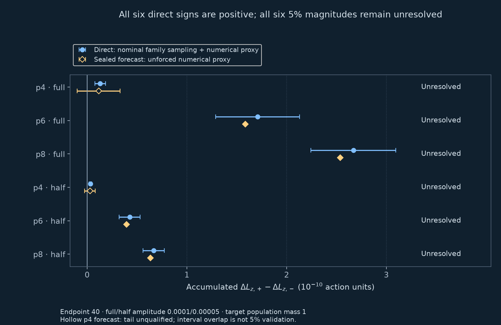
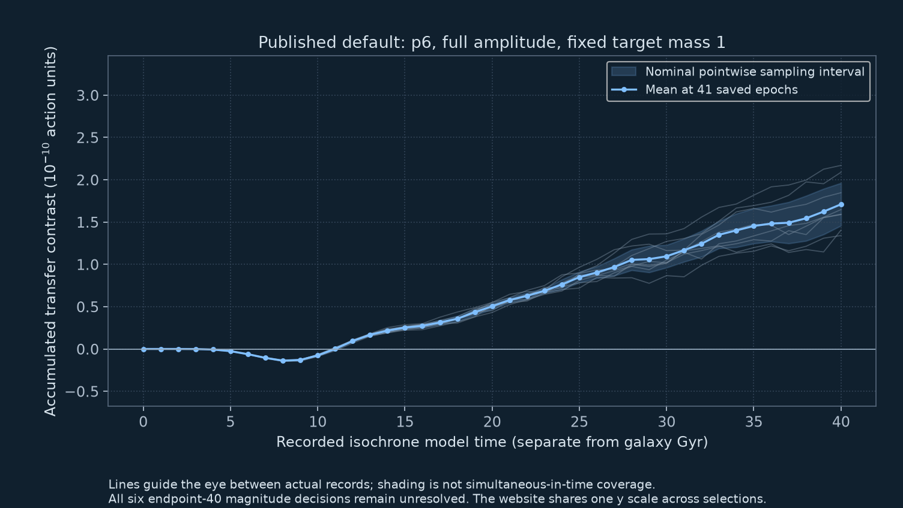
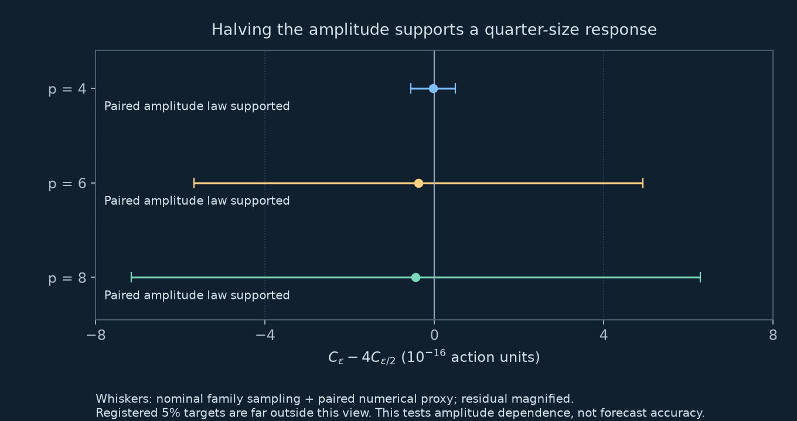

# The fixed weak-bar test of exact halo twins

Local publication candidate for the final discovery checkpoint. No new scientific
execution or external review is implied by this document.

## What the independently evolved orbits establish

Three smooth, positive isochrone populations retain the same continuum density,
all raw velocity moments of even total degree and all local mean velocities.
Their continuum local mean velocities vanish. Their odd velocity structure
differs. Under one fixed weak imposed bar, all six full/half-amplitude transfer
contrasts are positive under the registered nominal family allowances. All three
paired amplitude-law tests are supported. **All six five-percent magnitude
forecasts remain unresolved.** The p4 forecast also retains its radial-tail
limitation. Interval agreement is not five-percent magnitude validation.

The [interactive version](https://djova.ca/galaxy-bar/discovery-controls#twin-direct)
requires the website. The [complete static values](data/twins-prediction-v1.json)
and this explanation remain readable in the public source mirror. New result
links refer to the final checkpoint only after it is released.

## Three views of the same measurement



**DISC-TWIN-WEAK-01.** At endpoint 40, circles show independent orbit evolution
with the nominal nine-comparison family sampling allowance plus an empirical
numerical proxy. Diamonds show the sealed second-order forecast and its separate
unforced proxy. The hollow p4 diamond retains its unqualified tail. All six
five-percent magnitude comparisons are unresolved; interval overlap is not a
validation. The axis is accumulated physical Lz transfer Fplus minus Fminus in
reference action units, with common fixed target population mass one.
[Open the full-resolution endpoint figure](figures/twins-direct-endpoints-v1.png).



**DISC-TWIN-WEAK-02.** The default view is p6 at full amplitude. Eight library
curves, their mean and 41 saved epochs are real recorded values. Shading is a
nominal pointwise sampling interval, without simultaneous-time coverage or
numerical allowance. Isochrone model time is separate from the galaxy Gyr clock.
The website provides all six selections with one shared vertical scale and
readable internal chart scrolling on narrow screens. Its slider selects recorded
epochs, without interpolation. Both populations have positive recorded endpoint
transfer means; a positive contrast means Fplus absorbs more, not that the bar
gains angular momentum.
[Open the full-resolution history figure](figures/twins-direct-history-v1.png).



**DISC-TWIN-WEAK-03.** The paired residual is
\(C(\epsilon)-4C(\epsilon/2)\), in units of \(10^{-16}\) action. Whiskers
combine the nominal family sampling allowance and the paired numerical proxy.
The five-percent targets are far outside this magnified residual view. All
three amplitude-law comparisons are supported; this does not establish the
accuracy of the sealed coefficient. Raw paired operands and covariance are
available in the complete JSON.
[Open the full-resolution amplitude figure](figures/twins-direct-scaling-v1.png).

## Model, populations and observable

The external potential is the isochrone with \(G=M=1,b=0.5\). The
DFs cover the full halo, with fixed target mass one; realized sample mass is not
renormalized. This is separate from the canonical noisy-resonance paper's fixed
fast-action slice and the earlier amplitude-0.03, endpoint-300 bar experiment.
There is no live field response, imposed noise or SIDM collision operator.
Time and angular momentum are dimensionless reference units, without a physical
length/time calibration.

Writing \(e=-H_0>0\) for binding energy and \(L\) for total angular momentum,

\[
F_\pm=F_0(e)\pm\alpha_p L_z h_p(e,L),\qquad
h_p=-\frac{4p e^{p-1}}{(p+5/2)(p+7/2)}+
\left[\frac4{p+7/2}+L^2\right]e^p.
\]

The certified coefficients for \(p=4,6,8\) and the realized initial mass/spin
values appear in `populations`. The equal density/moment properties refer to the
continuum. Finite libraries have sampling error in odd moments; no sampled spin
was repaired after seeing a forced outcome. Continuum stationarity in this
analytic potential does not establish stability under self-gravity or the
softened live force law.

The rotating quadrupole has scale \(r_b=0.5\), fixed pattern speed
\(\Omega_{\rm bar}=0.42789218021407277\), quintic ramp \(S(t/10)\), full amplitude
\(\epsilon=10^{-4}\) and half amplitude \(5\times10^{-5}\), through endpoint 40:

\[
\Phi_{\rm bar}=-\epsilon S(t/10)r_b^3
\frac{(x^2-y^2)\cos(2\Omega_{\rm bar}t)+2xy\sin(2\Omega_{\rm bar}t)}
{(r_b^2+x^2+y^2+z^2)^{5/2}}.
\]

There is no pattern-speed sweep. Physical torque is accumulated along each orbit.
The quantity compared with theory is

\[
C_p(\epsilon,T)=\Delta L_{z,+}-\Delta L_{z,-}.
\]

A positive contrast means Fplus absorbs more angular momentum. Both populations
have positive recorded endpoint total-transfer means. The `population_transfer_context`
rows expose these totals without assigning an additional statistical qualification.
An externally prescribed bar has no evolving angular-momentum budget or measured
slowdown of its own.

## Prediction and normalization

The finite-time second-order prediction uses unforced frequencies, the physical
bar's Fourier coefficients and the analytical twin DF derivative. It was sealed
before direct evolution. Its full real-field complex coefficient convention,
conjugate factor and physical \(L_z\) versus slow \(J_s=L_z/2\) convention are
recorded in `forecast`; no forced result was fitted. The p4 unforced tail proxy
spans zero and remains unqualified. The p6/p8 provisional unforced numerical
qualifications are separate from the unresolved direct magnitude comparisons.

Eight independently seeded action libraries each have 16,384 families and eight
azimuth sectors per sense. The seeds are supplied. Phase and velocity-reversed
partners, amplitudes and numerical controls are paired. The raw sampled contrast
is \(\sum_i m_i h_{p,i}(B_{\rm pro}-B_{\rm retro})\). The physical half-mass cancels
the folded proposal factor two: no extra factor two, half or \((2\pi)^3\) belongs
in this already sampled contraction. Fixed target mass one is not a unit-mass
renormalization of each realized selection.

Base timestep is 0.02. The first two libraries also use 0.01 and doubled
16-sector sampling, at both amplitudes. Matched unforced controls, angular-momentum
and external-work budgets were retained. The 26 cases share populations and
controls; they are not 26 independent physical regimes. All states are retained.
This small public extraction does not contain every archived state or impulse.

## Endpoint uncertainty and the frozen decisions

The independent sampling unit is the whole library. With eight libraries,
\(c=t_7^{-1}(1-0.05/18)=3.946683866320812\) defines a nominal Bonferroni
nine-comparison family: six magnitude comparisons and three amplitude-law
comparisons. The components are correlated; Bonferroni does not require their
independence. Student-t coverage for these randomized quadrature libraries is
nominal and uncalibrated.

For each amplitude and population, the empirical numerical proxy is

\[
N=2\max_{b=0,1}|C^{\Delta t/2}_b-C^{\Delta t}_b|+
2\max_{b=0,1}|C^{16\,\rm phases}_b-C^{8\,\rm phases}_b|.
\]

It is not a rigorous discretization bound. The stored operands let a reader
recompute both terms. Set \(H=c\,\mathrm{SE}\), measured mean \(\mu\), sealed
forecast \(P\) and its separate proxy \(A\). Then

\[
L=\max(|\mu|-H-N,0),\quad U=|\mu|+H+N,\quad
E=|\mu-P|+H+N+A.
\]

Support of five-percent magnitude accuracy requires \(E\leq0.05L\).
Contradiction requires \(|\mu-P|-H-N-A>0.05U\). Everything else is unresolved.
The target is relative to the actual response; there is no absolute error floor.
All six records are unresolved. A direct sign is qualified separately when
\(|\mu|>H+N\).

For the amplitude law, form each paired library residual
\(Q_b=C_b(\epsilon)-4C_b(\epsilon/2)\). Compute its standard error from these
paired residuals, retaining their covariance. Use \(N_Q=N_\epsilon+4N_{\epsilon/2}\)
and the full-response \(L,U\). The same support/contradiction rule applies, with
no forecast proxy: it cancels from the amplitude-law test. All three supported
comparisons constrain amplitude dependence within this history, rather than the
accuracy of the sealed coefficient.

The endpoint family applies only at time 40. History plots join the 41 actual
integer records from 0 through 40. Their supplementary shading uses the nominal
pointwise factor 2.364624251592784, not simultaneous-in-time confidence and not
numerical allowances. Intermediate plotted lines are guides, not new measurements.

## Inspection, saved-value checking and numerical reproduction

[The JSON](data/twins-prediction-v1.json) contains eight raw nine-component vectors,
full covariance, all 12 refinement operands, six magnitude decisions, three
paired amplitude decisions, 48 contextual population rows and 1,968 history
values. Axis meanings, normalization, seeds, model and qualification scope are
inside that file. There are no missing values in the retained histories; an
unqualified decision is a status, not a zero physical response.

From the public scientific package, run

```sh
python discovery/scripts/discovery/replay_twins_prediction.py
```

The saved-value reader requires the package's pinned NumPy dependency. It
reconstructs means, covariance, numerical proxies, intervals, nine decisions,
context identities and history/endpoint agreement. It checks the frozen critical
constants; it does not derive their quantiles, calibrate coverage or integrate
orbits. This verification uses the published operands and does not independently
reproduce the archived physical trajectories or all arrays. The earlier portable
unforced forecast has separate bounded execution instructions; reading these
files never launches it.

The source extraction SHA256 is
`61d61a04adf180861ae1a758e55b63d749ae4c3e9d895b324f37beaf895e833e`.
Its terminal and sealed-forecast evidence hashes are recorded in
`scientific_provenance`. This publication adds no live halo, bar slowdown,
formation-history, observational or SIDM claim. Priority and practical usefulness
still require specialist criticism; no external review is implied. Original code,
derived data and explanatory text follow the benchmark's MIT terms; external
numerical libraries retain their own licences.
