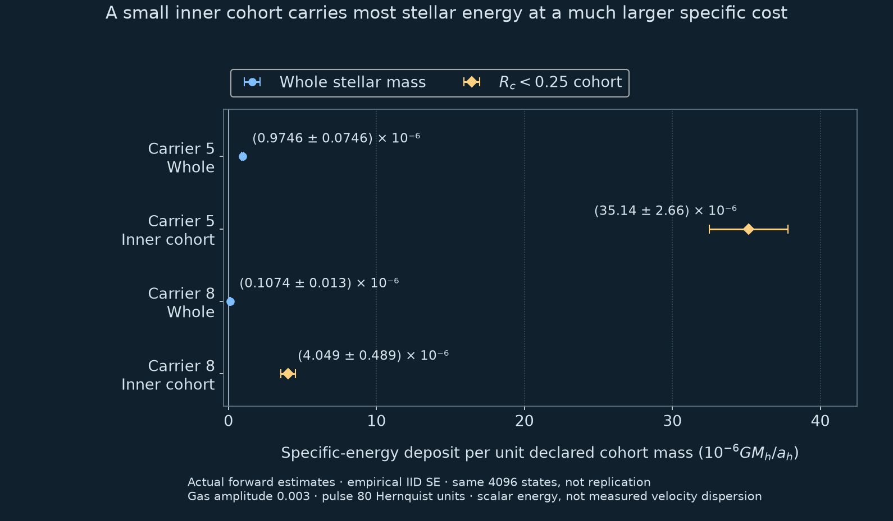

# Stellar energy costs in the fixed cuspy potential

The final native refinement closes the frozen necessary numerical checks for one
unchanged 4,096-state stellar sample. It measures scalar orbital-energy transfer,
not the growth of random stellar motion. Original failed and cost-stopped stages
remain separate historical outcomes. The study is AI-assisted and has not been
externally reviewed.

## The result and its population



**DISC-WARM-COST-01.** Actual-forward energy estimates, without matched-zero
subtraction, share one linear axis. Whiskers are empirical IID standard errors;
they are not confidence intervals or discretization bounds. The whole population
uses independently declared mass one; the inner guiding cohort uses its known
physical mass. A small whole-population average hides a much larger specific
cost for the inner cohort. [Open the full-resolution figure](figures/warm-cost-v1.png).

The initial guiding distribution is \(p(R_c)=R_c e^{-R_c}\). The fixed
\(R_c<0.25\) cohort therefore has mass

\[
M_{\rm inner}=1-(1+0.25)e^{-0.25}=0.026499021160743902.
\]

Its paired energy-contribution fractions at carriers 5/8 are
\(95.5580\%\pm2.4705\) and \(99.8834\%\pm0.0682\) percentage points.
These are same-sample delta-method errors. A contribution ratio is not a mass
fraction and may fall outside zero to one for a signed response. No weights are
clipped, no negative terms removed and no realized sample mass renormalized.
Guiding radius is neither current spatial radius nor the halo's binding-energy
tag; there is no co-spatial halo/star comparison here.

## What evolves

The potential contains a fixed Hernquist halo and two positive, mass-normalized,
finite-support gas components. Use \(G=M_h=a_h=1\); gas mass is 0.1, gas scales
0.2/1.3 and cutoff 8. Their mass fractions are \(0.5+a(t)\) and \(0.5-a(t)\),
with

\[
a(t)=0.003\sin^2(\pi t/80)\cos(\omega t),\qquad 0\le t\le80,
\]

and zero outside the pulse. The only recorded carriers are \(\omega=5,8\).
No gas dynamics or live self-gravity evolves the field. The 80-unit Hernquist
clock is not galaxy time in Gyr or the independent isochrone-bar clock.

At fixed \(L=R_c v_c(R_c)\), the canonical radial population is

\[
g_L=\frac{\exp(-J_r/J_s)}{2\pi J_s},\qquad
J_s=\frac{(0.1v_c)^2}{\kappa}.
\]

Inclination/orientation is marginalized exactly for this spherical energy
observable. The action-population parameter 0.1 is not a measurement of final
radial or vertical velocity dispersion. The fixed full-support importance
proposal, original seed 201065 and all original weights/states are retained,
including physically underflowed zero weights in the all-state numerical checks.

## Estimators, covariance and uncertainty

The ordinary signed estimate contracts physical weights with forward orbital
\(\Delta E\). A finite-displacement remainder uses the primitive
\(F_L(E)=-\int_E^0g_L(e)\,de\), extended by zero at \(E\ge0\), and retains
its inverse-support term. Its exact-flow expectation identity does not establish
accuracy of approximate actions or numerical trajectories. The JSON specifies
the full operator and target/proposal factors. These are correlated estimators
of one response on the same states, not independent confirmations.

The plotted `actual_forward` estimates omit matched-zero subtraction. `paired`
uses the same state's zero-pulse control. The zero means are tiny and do not
change the displayed rounded values. Their exact values remain in the tables
and [complete approved JSON](data/warm-cost-v1.json).

For weighted paired response \(Y_i\) and indicator
\(B_i=\mathbf1(R_{c,i}<0.25)\), write

\[
u=\frac{\overline{YB}}{\overline Y},\qquad
I_i=\frac{Y_i(B_i-u)}{\overline Y}.
\]

The empirical standard error comes from this covariance-aware influence, not
independent numerator/denominator errors. When verifying rounded summary
covariances near a contribution ratio of one, direct subtraction of nearly equal
terms can lose precision. The saved-summary reader uses the equivalent exterior
complement and its supplied variance. It preserves the relative tolerance
\(3\times10^{-12}\); it does not turn an approximate error estimate into a
confidence guarantee. Energy ESS and ranked contribution shares are descriptive;
unsampled-tail coverage remains unestablished.

## Numerical closure and retained failures

Coarse/fine steps are 0.000625/0.0003125. The final maximum scaled all-state
inverse errors are \(3.1547\times10^{-13}\) and
\(6.6813\times10^{-13}\), within the unchanged \(10^{-9}\) allowance.
Necessary gates also require positive paired means; empirical SE at most 30% of
the mean; two independently formulated energy/work residuals at most 5%;
curvature 32/64 and action 128/256 changes at most 1%; paired timestep change at
most 5%; and mean absolute arithmetic change at most 1%. All original states
remain in the inverse checks. Selected adaptive radial/Cartesian references
have named-path scope and cannot bound errors on every omitted orbit.

The suffix `_64` refers to 64-point curvature quadrature, not storage precision.
The new phase maps and signed energies use genuine extended precision. The
complete coarse map agrees numerically with the earlier extended implementation
on seven fields, including signed zeros; non-numeric storage padding is excluded.
The new refinement is the same physical draw, not a new independent sample.

The original binary64 inverse errors exceed the frozen allowance; that stage
remains failed. The first all-state extended implementation remains
`COST_PARTIAL`. Reader01 remains failed: it reordered `(raw*mask)/mass` as
`raw*(mask/mass)` in a strict covariance comparison. The reviewed reader02
restores the source operation order, keeping exact equality, unchanged thresholds
and means. This is numerical bookkeeping, not additional physical evidence.

## What an energy deposit does not establish

Positive mean energy is not necessarily random-motion heating. As an
illustration, \(p_r\mapsto p_r+k\) for an initially zero-mean distribution
adds \(k^2/2\) to mean kinetic energy but leaves \(\mathrm{Var}(p_r)\)
unchanged. This identity is not a measured account of these gas pulses.
Coherent flow, \(\sigma_R\), \(\sigma_z\) and disk thickness were not measured.
There is no stellar-survival bound, observed-galaxy validation, core formation,
finite halo/star ratio or general no-hide theorem. The earlier tiny halo energy
gain and its separate historical numerical records are not superseded here.

## Inspecting and checking the public values

The [JSON](data/warm-cost-v1.json) includes exact figure values, covariance summaries,
coarse/fine gate operands, paired refinements, descriptive concentration and
source/array hashes. Archived array hashes do not imply public availability of
all arrays. The public package supports inspection and saved-summary arithmetic:

```sh
python discovery/scripts/discovery/replay_warm_cost.py
```

The reader uses the package's pinned NumPy dependency. It reconstructs 227 scalar
relationships and threshold decisions from the supplied records, including the
stable contribution-ratio errors. It does not rerun trajectories, re-contract
private arrays, prove continuum error or calibrate confidence coverage. Reading
these files launches no job. The [plotting source](scripts/discovery/plot_warm_cost.py) likewise renders
only the recorded means and empirical standard errors.

The approved extraction SHA256 is
`1ab14e21360f7c2f7a85ea3e207f5f0dc1b3ca88032a0ca00b2c87f55a92f2c5`.
The final numerical and strict saved-array reader hashes/selectors are supplied
in `provenance`; their scopes differ from this public summary checker. New
original code, derived data and explanatory text use the benchmark's MIT terms;
external dependencies retain their own licences. Use the public issue route for
scientific criticism. Priority and applicability still need specialist review.
