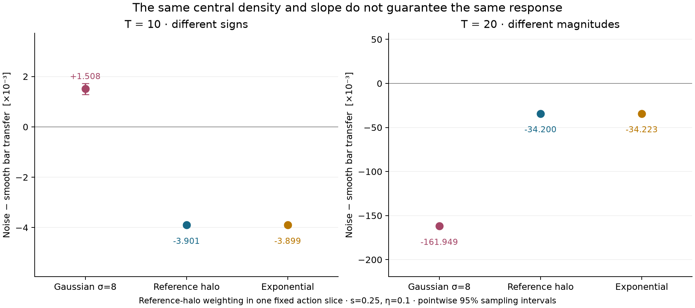
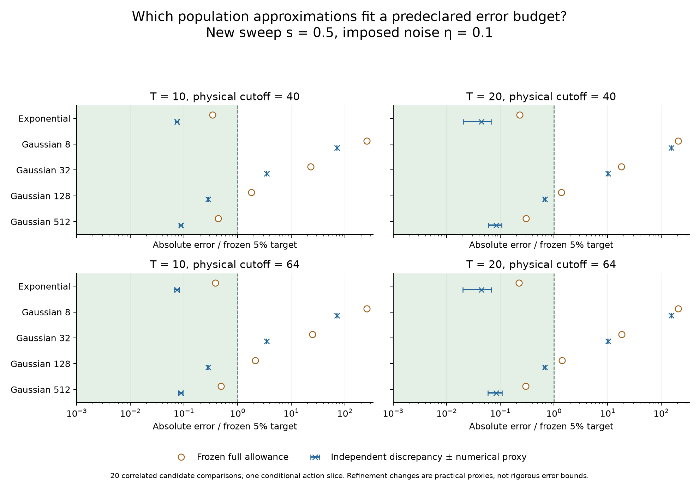
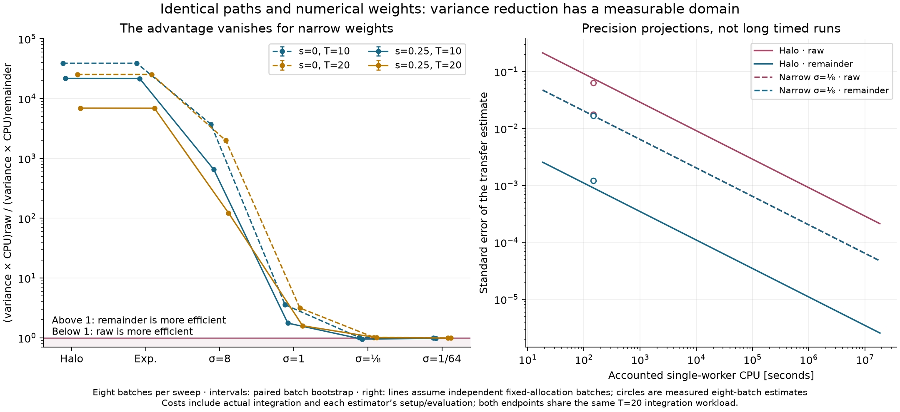

# Finite-time population bias in noisy sweeping resonances

*A response-kernel benchmark and an operational test of population approximations*

<p class="publication-meta">Canonical article · Release 2026-09-23.1 · Not externally reviewed · <a href="reproduce.html#licenses">Human maintainer and AI disclosure</a></p>

## Abstract {#abstract}

A local resonance calculation must specify which orbital population its dynamics act upon. We demonstrate **finite-time population-selection bias in a prescribed noisy sweeping-resonance model**, and provide a reproducible response-kernel diagnostic and variance-reduced estimator for assessing that bias. At matched central density and slope, a selected Gaussian and reference-halo weighting in the tested action slice give opposite early noise effects. Their later suppression magnitudes differ by a factor of **4.735323**. A slope-matched exponential closely follows the halo calculation. At one new sweep rate, all **eight advance 5% qualifications** survive independent numerical comparison; four other accurate comparisons are conservatively rejected.

This is a bounded computational-methods result. It does not establish a new physical torque mechanism, a complete halo torque, or a validated prediction for a live galaxy. The galaxy simulations are collisionless. The local noise model is not a calibrated SIDM collision operator. **These experiments do not test CDM against SIDM.**

[Learn the foundations](learn.html) · [Inspect and reproduce](reproduce.html) · [Claim registry](claims.json) · [Download this article](paper.md)

## Which physical system is being discussed? {#models}

| Model ID | What evolves | What this establishes | Clock / methods |
| --- | --- | --- | --- |
| GAL-LIVE — Self-gravitating galaxy and its fixed-field controls | Stellar and halo particles; live components alter gravity. Named frozen/static controls remove specified response. | Behavior and numerical sensitivity of the specified galaxy models; No SIDM comparison; no converged universal bar-strength prediction | Gyr; kpc; solar masses · [methods](methodology.html) |
| CART-EXT — Prescribed-field Cartesian orbits | Test particles in an external analytical field, imposed bar and disturbances; cloud does not react collectively | Particle response to those specified external fields; Not live-halo validation | Analytical-potential model time/action · [methods](response-methods.html) |
| RES-POS — Reduced noisy resonance, positive population | Slow action and resonant angle; constant additive action diffusion; fixed fast-action slice | Population response and numerical accuracy within this local operator; Not full-halo torque, SIDM or general confidence coverage | Dimensionless T, x and impulse B · [methods](paper.html#model) |
| RES-SIGNED — Earlier signed perturbation with reservoirs | Signed deviation with its own reservoir/boundary conditions | Verification and response of that separate setup; Not interchangeable with positive-population results | Its documented reduced-model units · [methods](noise-methods.html) |
| SYNTH — Synthetic controls | Known stochastic laws or analytical limiting processes | Verification of estimators, coordinates or numerical algorithms; Not a new astrophysical measurement | Control-specific units · [methods](response-validation.html) |


The results below concern model **RES-POS**, a positive initial population in a local resonance with imposed noise. Earlier signed-perturbation calculations with reservoirs (**RES-SIGNED**) have different initial and boundary conditions. They are retained as supporting experiments, not interchangeable resolutions of RES-POS. The original self-gravitating galaxies motivate the question; they do not validate the reduction. Even a successful prescribed-field Cartesian test would still leave collective live-halo response untested.

## What was already known? {#previous-work}

[Hamilton, Tolman, Arzamasskiy & Duarte](https://arxiv.org/abs/2208.03855) studied how diffusion sustains stationary resonant friction, including an initially linear local distribution. [Chiba](https://arxiv.org/abs/2305.00022) studied moving-resonance feedback, compared collisionless reduced dynamics with three-dimensional calculations, and anticipated that diffusion can replenish a friction-producing gradient while erasing a trapped–untrapped density contrast. [Ogilvie & Lubow](https://doi.org/10.1111/j.1365-2966.2006.10506.x) treated a related migration–diffusion competition at planetary corotation in gas. Different physical assumptions prevent treating that analogue as a galactic-halo prediction.

Variance reduction also has direct astrophysical predecessors. [Elbers et al. (2021), sections 2–2.3](https://arxiv.org/pdf/2010.07321), use a δf decomposition to sample departures from a model neutrino distribution and explicitly formulate its control-variate interpretation. Their cosmological calculation includes gravitational feedback. Here the control instead uses a zero-integral primitive identity for accumulated bar impulse under a prescribed canonical map. This is a useful comparison of constructions and assumptions; equivalence, optimality and priority of our specific estimator remain unestablished. We do not claim the control-variate principle as new.

Our addition is the quantified population counterexample, a reusable recorded response calculation, and a prospectively tested accuracy procedure with a measured estimator-cost comparison. A targeted literature review is not an exhaustive priority search. [Detailed scholarly positioning](diagnostics/population-accuracy/SOURCES.md).

## Model, populations and observable {#model}

The implemented frequency gradient is negative. In dimensionless slow action j and resonant angle ψ, measured relative to the moving resonance:

```text
(EQ-DYN-01)   dψ = −j dt
             dj = (−sin ψ − s) dt + √(2D) dW,   D = 2η/π
(EQ-OBS-01)   B(T) = −∫₀ᵀ sin ψ dt
```

The accumulated bar impulse B excludes the moving-coordinate term −sT and Brownian impulse. The path budget checks all three separately. Our response is **noise minus smooth accumulated bar-mediated transfer**, not instantaneous torque. Positive means more transfer from the imposed bar to the sampled slice. Negative means less than the smooth control, and need not mean that the bar gains angular momentum.

The initial resonant phase is uniform. The reference is an analytical isochrone-halo distribution function evaluated at fixed fast actions: radial action 0.08 and vertical action 0.05, central slow action Jₛ,₀ = 0.25. Set x = (Jₛ − Jₛ,₀)/u, u ≈ 0.0005633691. The initial logarithmic slope is g ≈ −0.0047493212. Before the common compact window:

```text
(EQ-POP-01)   halo:        wH(x) = fhalo(Js, fixed fast actions) / fref
             exponential: wE(x) = exp(gx)
             Gaussian:    wσ(x) = exp(gx − x²/(2σ²))
```

Central density and slope are held fixed; populations are **not renormalized to unit mass**. The primary window has plateau 24 and cutoff 40; the wider comparison has plateau 48 and cutoff 64 in x. Moving this physical taper differs from enlarging the solver domain or auxiliary sampling support. These are conditional contributions from one slice, not integrals over an entire halo.

All response tables display dimensionless ∫wKᵦ dx. Multiplication by 4u²(2π)³fref ≈ 2.7022892 × 10⁻⁶ gives the angular-momentum contribution **per unit fast-action area** in the analytical model's units. The local time T is dimensionless; it is not the original galaxy's Gyr clock. T = 20 is about 3.18 reference librations. [Exact calibration, windows and numerical algorithms](population-methods.html).

## Population choice changes the finite-time answer {#population-result}

<p class="publication-claim" id="POP-01"><a href="claims.json">POP-01</a> · At s=0.25, Gaussian and reference-halo weighting in the tested slice have opposite T=10 responses; their T=20 suppression magnitudes differ by 4.735323.</p>

<figure id="F-POP-01" class="accuracy-figure"><a href="diagnostics/population-accuracy/population-comparison.png"></a><figcaption>F-POP-01 · Original Gaussian has opposite early sign; halo and exponential closely agree. Values follow. Local resonance units; reference-halo weighting means one fixed fast-action slice. Parameters, uncertainty and complete values follow immediately below.</figcaption></figure>

| Population | T | Response | 95% lower | 95% upper | Numerical/window qualified |
| --- | --- | --- | --- | --- | --- |
| Gaussian σ=8 | 10 | 0.00150764622 | 0.00128939881 | 0.00172589363 | yes |
| Reference halo | 10 | -0.00390067586 | -0.00396285817 | -0.00383849356 | yes |
| Slope-matched exponential | 10 | -0.0038987336 | -0.00396095025 | -0.00383651696 | yes |
| Gaussian σ=8 | 20 | -0.161949145 | -0.162575063 | -0.161323226 | yes |
| Reference halo | 20 | -0.0342002314 | -0.034326595 | -0.0340738678 | yes |
| Slope-matched exponential | 20 | -0.0342234835 | -0.0343499518 | -0.0340970151 | yes |


**Figure F-POP-01.** Sweep s = 0.25, imposed noise η = 0.1, cutoff 40, two recorded endpoints. Intervals are pointwise 95% Student-t intervals across eight independent trajectory batches, with paired controls retained separately. The early signs survive the declared timestep/window allowances. The late ratio is conditional on this population, slice and duration. [Complete values and numerical controls](results/populations.json); [interactive weighting](population-response.html#population-explorer). Analysis version and checksums: [DS-POP](datasets.json).

The exponential's point differences are about 0.050% and 0.068%. These are not certified sub-0.1% accuracies. The paired sampling and numerical assessment is in [the difference record](diagnostics/population-accuracy/joint-error-assessment.json). Matching a slope at one point can impose the wrong curvature; preserving the gradient over the sensitive region can work well.

At T = 10, the Gaussian's gradient-coordinate contributions inside and outside radius four are approximately −0.011058 + 0.012565 = +0.001508. For the halo they are −0.004835 + 0.000934 = −0.003901. Different cancellation changes the sign. **These terms are an integral decomposition, not two literal orbital cohorts.** The [original explorer](population-response.html) distinguishes these coordinates from initial-orbit cohorts.

## Why a response kernel is reusable {#kernel}

For fixed, population-independent evolution, define the phase/noise-averaged action response Kᵦ(x). Let Qₚ denote its primitive; the subscript distinguishes it from the galaxy's Toomre Q.

```text
(EQ-KER-01)   Kᵦ(x) = E[Bnoise − Bsmooth | initial action x]
             R[w] = ∫w Kᵦ dx = [w Qₚ]boundary − ∫w′ Qₚ dx
```

For the common compact support, the boundary term vanishes. Nonlinear trapping of individual orbits is compatible with linear dependence on the initial population. This identity does not automatically apply to a self-consistent gravitational field or a collision law whose coefficients depend on the evolving population.

The kernel separates dynamical sensitivity from how much material occupies each action. Forecasting another population tests the accuracy and reuse of this numerical calculation; it does not discover a new linearity principle. A new dynamical condition needs its own kernel.

## An error allowance that can decline to predict {#accuracy}

For a candidate approximation v and reference h, the exact-kernel inequality is:

```text
(EQ-ERR-01)   |R[v] − R[h]| ≤ ∫ |v′ − h′| |Qₚ| dx
```

Include the boundary mismatch if it is nonzero. The implemented kernel is estimated, so its plug-in integral alone is not a rigorous bound. The protocol uses eight independent batch estimates, a nominal simultaneous Student-t envelope with Bonferroni allocation across finite kernel cells and scalar contractions, paired timestep differences, and factor-two mesh refinements. Population contractions retain covariance from shared paths. Antithetic partners, times, windows and population weights are not independent batches.

The full allowance combines population mismatch and the approximate response's sampling/numerical allowance. Its 5% target uses a conservative lower estimate of the halo response. Near cancellation, report absolute error and leave the percentage unqualified. Measured refinement differences are **numerical proxies**, not proved bounds; general confidence coverage has not been established.

<p class="publication-claim" id="PA-ACC-01"><a href="claims.json">PA-ACC-01</a> · Eight advance 5% qualifications are supported by independent numerical comparison at one new sweep rate, s=0.5.</p>

The prospective condition has s = 0.5, η = 0.1. Populations, both times, both windows, forecasts and criteria were frozen before independent evolution. Fourteen independent numerical cases combine positive distribution evolution with collisionless characteristic calculations, including timestep, mesh and domain controls. They are distinct computational pathways; the stochastic kernel was not fitted to their outcomes. [Frozen protocol](diagnostics/population-accuracy/PLAN.md) · [full outcome](diagnostics/population-accuracy/ACCURACY_OUTCOME_01.md).

<figure id="F-ACC-01" class="accuracy-figure"><a href="diagnostics/population-accuracy/population-accuracy.png"></a><figcaption>F-ACC-01 · All twenty approximation candidates, including four conservative Gaussian128 rejections. Complete values follow. Local resonance units; reference-halo weighting means one fixed fast-action slice. Parameters, uncertainty and complete values follow immediately below.</figcaption></figure>

**Figure F-ACC-01.** All twenty candidates at one new condition. Orange circles show full forecast allowances; blue crosses show approximate-kernel forecast discrepancy against the independently evolved halo, including its numerical proxy. Both are scaled by the frozen 5% target. This discrepancy is distinct from **intrinsic population error**, R[v] − R[h], which the paired independent calculation also measures. The four halo self-references are excluded from candidate counts. [Complete table](#table-accuracy) · [DS-ACC metadata](datasets.json).

### Interrogate the decision {#interactive-decision}

[Interactive decision explorer](paper.html#interactive-decision). All recorded outcomes are tabulated below.

### Complete accuracy values {#table-accuracy}

| ID / population · T · window | Kernel forecast | Independent response | Intrinsic error ± proxy | Forecast − independent halo | Full allowance / 5% target | Advance 5% / independent |
| --- | --- | --- | --- | --- | --- | --- |
| <a id="ACC-halo-T10-W40" href="paper.html?population=halo&amp;time=10&amp;window=40#interactive-decision">Reference halo · 10 · 40</a> (reference) | -0.00886738702 | -0.0088400079 | 0 ± 0 | -2.73791146e-05 | 0.000113244174 / 0.000437707142 | Qualified / supported |
| <a id="ACC-exponential-T10-W40" href="paper.html?population=exponential&amp;time=10&amp;window=40#interactive-decision">Slope-matched exponential · 10 · 40</a> | -0.0088723455 | -0.00884491869 | -4.91078514e-06 ± 7.70468092e-09 | -3.23375997e-05 | 0.000148862064 / 0.000437707142 | Qualified / supported |
| <a id="ACC-gaussian8-T10-W40" href="paper.html?population=gaussian8&amp;time=10&amp;window=40#interactive-decision">Gaussian σ=8 · 10 · 40</a> | -0.0398135751 | -0.0396109614 | -0.0307709535 ± 3.05130755e-05 | -0.0309735672 | 0.113123884 / 0.000437707142 | Not qualified / contradicted |
| <a id="ACC-gaussian32-T10-W40" href="paper.html?population=gaussian32&amp;time=10&amp;window=40#interactive-decision">Gaussian σ=32 · 10 · 40</a> | -0.0103457493 | -0.0103050984 | -0.00146509045 ± 2.23114269e-06 | -0.00150574144 | 0.0100394536 / 0.000437707142 | Not qualified / contradicted |
| <a id="ACC-gaussian128-T10-W40" href="paper.html?population=gaussian128&amp;time=10&amp;window=40#interactive-decision">Gaussian σ=128 · 10 · 40</a> | -0.00896218156 | -0.0089338922 | -9.38842914e-05 ± 1.47467e-07 | -0.000122173657 | 0.000794600692 / 0.000437707142 | Not qualified / supported |
| <a id="ACC-gaussian512-T10-W40" href="paper.html?population=gaussian512&amp;time=10&amp;window=40#interactive-decision">Gaussian σ=512 · 10 · 40</a> | -0.00887795134 | -0.00885047045 | -1.04625485e-05 ± 1.64425664e-08 | -3.79434334e-05 | 0.000189338267 / 0.000437707142 | Qualified / supported |
| <a id="ACC-halo-T10-W64" href="paper.html?population=halo&amp;time=10&amp;window=64#interactive-decision">Reference halo · 10 · 64</a> (reference) | -0.00886970857 | -0.0088424281 | 0 ± 0 | -2.72804678e-05 | 0.000125126449 / 0.000437229106 | Qualified / supported |
| <a id="ACC-exponential-T10-W64" href="paper.html?population=exponential&amp;time=10&amp;window=64#interactive-decision">Slope-matched exponential · 10 · 64</a> | -0.00887466249 | -0.00884733137 | -4.90327501e-06 ± 1.07602545e-08 | -3.22343933e-05 | 0.000167582146 / 0.000437229106 | Qualified / supported |
| <a id="ACC-gaussian8-T10-W64" href="paper.html?population=gaussian8&amp;time=10&amp;window=64#interactive-decision">Gaussian σ=8 · 10 · 64</a> | -0.039813574 | -0.0396109618 | -0.0307685337 ± 2.96698035e-05 | -0.0309711459 | 0.112054479 / 0.000437229106 | Not qualified / contradicted |
| <a id="ACC-gaussian32-T10-W64" href="paper.html?population=gaussian32&amp;time=10&amp;window=64#interactive-decision">Gaussian σ=32 · 10 · 64</a> | -0.0103469499 | -0.0103061665 | -0.00146373843 ± 2.43893043e-06 | -0.00150452184 | 0.0108583051 / 0.000437229106 | Not qualified / contradicted |
| <a id="ACC-gaussian128-T10-W64" href="paper.html?population=gaussian128&amp;time=10&amp;window=64#interactive-decision">Gaussian σ=128 · 10 · 64</a> | -0.00896441884 | -0.00893617755 | -9.37494552e-05 ± 1.95531726e-07 | -0.000121990741 | 0.000929584953 / 0.000437229106 | Not qualified / supported |
| <a id="ACC-gaussian512-T10-W64" href="paper.html?population=gaussian512&amp;time=10&amp;window=64#interactive-decision">Gaussian σ=512 · 10 · 64</a> | -0.00888026334 | -0.00885287494 | -1.04468434e-05 ± 2.24912369e-08 | -3.78352457e-05 | 0.000215716763 / 0.000437229106 | Qualified / supported |
| <a id="ACC-halo-T20-W40" href="paper.html?population=halo&amp;time=20&amp;window=40#interactive-decision">Reference halo · 20 · 40</a> (reference) | -0.0661634001 | -0.0661331971 | 0 ± 0 | -3.02029798e-05 | 0.000546072501 / 0.00328086638 | Qualified / supported |
| <a id="ACC-exponential-T20-W40" href="paper.html?population=exponential&amp;time=20&amp;window=40#interactive-decision">Slope-matched exponential · 20 · 40</a> | -0.0662762799 | -0.0662460699 | -0.000112872735 ± 3.18237406e-07 | -0.000143082815 | 0.000753037978 / 0.00328086638 | Qualified / supported |
| <a id="ACC-gaussian8-T20-W40" href="paper.html?population=gaussian8&amp;time=20&amp;window=40#interactive-decision">Gaussian σ=8 · 20 · 40</a> | -0.570824503 | -0.570685682 | -0.504552485 ± 0.00092853291 | -0.504691306 | 0.675506654 / 0.00328086638 | Not qualified / contradicted |
| <a id="ACC-gaussian32-T20-W40" href="paper.html?population=gaussian32&amp;time=20&amp;window=40#interactive-decision">Gaussian σ=32 · 20 · 40</a> | -0.0991751529 | -0.0991428226 | -0.0330096254 ± 9.04520944e-05 | -0.0330419558 | 0.0593473779 / 0.00328086638 | Not qualified / contradicted |
| <a id="ACC-gaussian128-T20-W40" href="paper.html?population=gaussian128&amp;time=20&amp;window=40#interactive-decision">Gaussian σ=128 · 20 · 40</a> | -0.0683290608 | -0.0682987261 | -0.00216552899 ± 6.11217596e-06 | -0.00219586364 | 0.00451776613 / 0.00328086638 | Not qualified / supported |
| <a id="ACC-gaussian512-T20-W40" href="paper.html?population=gaussian512&amp;time=20&amp;window=40#interactive-decision">Gaussian σ=512 · 20 · 40</a> | -0.0664045621 | -0.0663743443 | -0.000241147163 ± 6.80995613e-07 | -0.000271365005 | 0.000988743067 / 0.00328086638 | Qualified / supported |
| <a id="ACC-halo-T20-W64" href="paper.html?population=halo&amp;time=20&amp;window=64#interactive-decision">Reference halo · 20 · 64</a> (reference) | -0.0661736164 | -0.066142906 | 0 ± 0 | -3.07104753e-05 | 0.000519889295 / 0.00328268636 | Qualified / supported |
| <a id="ACC-exponential-T20-W64" href="paper.html?population=exponential&amp;time=20&amp;window=64#interactive-decision">Slope-matched exponential · 20 · 64</a> | -0.0662864735 | -0.0662557552 | -0.000112849281 ± 3.14117196e-07 | -0.000143567573 | 0.000733737515 / 0.00328268636 | Qualified / supported |
| <a id="ACC-gaussian8-T20-W64" href="paper.html?population=gaussian8&amp;time=20&amp;window=64#interactive-decision">Gaussian σ=8 · 20 · 64</a> | -0.570824507 | -0.570685685 | -0.504542779 ± 0.000927460422 | -0.504681601 | 0.674266443 / 0.00328268636 | Not qualified / contradicted |
| <a id="ACC-gaussian32-T20-W64" href="paper.html?population=gaussian32&amp;time=20&amp;window=64#interactive-decision">Gaussian σ=32 · 20 · 64</a> | -0.0991807238 | -0.0991477929 | -0.0330048869 ± 8.97728828e-05 | -0.0330378178 | 0.0601306957 / 0.00328268636 | Not qualified / contradicted |
| <a id="ACC-gaussian128-T20-W64" href="paper.html?population=gaussian128&amp;time=20&amp;window=64#interactive-decision">Gaussian σ=128 · 20 · 64</a> | -0.0683388449 | -0.0683079968 | -0.00216509083 ± 6.0403304e-06 | -0.00219593894 | 0.00461589381 / 0.00328268636 | Not qualified / supported |
| <a id="ACC-gaussian512-T20-W64" href="paper.html?population=gaussian512&amp;time=20&amp;window=64#interactive-decision">Gaussian σ=512 · 20 · 64</a> | -0.0664147295 | -0.0663840031 | -0.000241097167 ± 6.7249861e-07 | -0.000271823514 | 0.000977177308 / 0.00328268636 | Qualified / supported |

[JSON](results/accuracy.json) · [CSV](results/accuracy.csv). Numeric uncertainty is defined in the protocol above; a deterministic proxy is not a sampling confidence interval.

<p class="publication-claim" id="PA-ACC-02"><a href="claims.json">PA-ACC-02</a> · Four Gaussian-128 comparisons meet 5% in the independent assessment but are not qualified by the conservative absolute-gradient allowance.</p>

At primary-window T = 10, Gaussian 128's signed mean-kernel contrast has magnitude about 0.00009479, whereas the absolute-gradient integral is about 0.00052005, already above the 0.00043771 target before explicit kernel uncertainty. Discarding cancellation explains part of the conservative rejection. More samples alone need not repair it. All twenty independent population discrepancies plus their proxies fit their stated gradient allowances. All new-condition responses are negative: this prospective test does not validate performance across both signs.

The new kernel cost about 5,105 worker CPU-seconds; the six-profile diagnostic took about 0.8 seconds. If the full DF and kernel are already known, the full contraction is also cheap. The diagnostic audits a simplifying assumption; it does not make the kernel free or always beat direct use of the known DF.

## Estimating a small response efficiently {#estimator}

Let F′ = w and y = j + sT − W = x + B. Under the stated external additive noise, uniform initial phase and canonical evolution, a zero-integral primitive identity gives:

```text
(EQ-EST-01)   ∫ w(x) E[B] dx = −∫ E[F(x+B) − F(x) − w(x)B] dx
```

The right side estimates a nonlinear remainder, whose leading term for a slowly varying weight involves w′B²/2. The first-order contribution has known zero ensemble integral. The derivation requires more than area preservation alone. Auxiliary initial-action support must extend beyond the physical window by the maximum bar impulse; those samples do not add physical halo mass. Do not transplant this identity to action-dependent forcing/noise, nonuniform phases or live response without another derivation. [Complete derivation and support restrictions](https://github.com/djova/bar-halo-benchmark/blob/cdb30b5b2f350d2f3de6831995b83f281fe2974e/accuracy/research/population-response/CUMULATIVE_IDENTITY.md).

<p class="publication-claim" id="EST-01"><a href="claims.json">EST-01</a> · The matched estimator has a large conditional cost-times-variance advantage for broad halo weights; the advantage disappears for the narrowest stress population.</p>

<figure id="F-COST-01" class="accuracy-figure"><a href="diagnostics/population-accuracy/estimator-efficiency.png"></a><figcaption>F-COST-01 · Large broad-population variance advantage falls to about unity at the narrowest stress width. Values follow. Local resonance units; reference-halo weighting means one fixed fast-action slice. Parameters, uncertainty and complete values follow immediately below.</figcaption></figure>

**Figure F-COST-01.** Matched raw and remainder estimates use identical paths and discrete weights. Cost includes integration to T = 20, the paired timestep control, setup and method-specific evaluation; I/O and common covariance assembly are excluded from both. T = 10 is charged that same workload. Conditional and between-batch variance estimates differ. Error bars are whole-batch bootstrap intervals, not universal runtime guarantees. [All recorded values](#table-cost) · [DS-COST metadata](datasets.json).

[Interactive estimator comparison](paper.html#estimator). All recorded outcomes are tabulated below.

### Complete estimator-cost values {#table-cost}

| Population · s · T | Raw / remainder CPU s | Cost×variance ratio | Bootstrap interval | Between-batch ratio | Raw−remainder 95% interval |
| --- | --- | --- | --- | --- | --- |
| halo · 0.0 · 10 | 18.2927416 / 18.4636202 | 38988.5558 | [38008.699, 40043.7838] | 89013.143 | [-0.0469247543, 0.111264275] |
| exponential · 0.0 · 10 | 18.2873912 / 18.4509676 | 39002.9004 | [38024.4573, 40062.5082] | 89093.6618 | [-0.0469219707, 0.111260408] |
| gaussian8 · 0.0 · 10 | 18.2879427 / 18.4467792 | 3730.44102 | [3579.87624, 3919.33533] | 6777.02582 | [-0.0370077712, 0.102973788] |
| stress1 · 0.0 · 10 | 18.2888599 / 18.4464164 | 3.57293977 | [3.46038643, 3.69321681] | 2.10966059 | [0.00189734593, 0.0705498717] |
| stress0.125 · 0.0 · 10 | 18.2890393 / 18.4529955 | 1.0167378 | [0.997359472, 1.03637194] | 0.689486757 | [-0.0025506543, 0.0206194091] |
| stress0.015625 · 0.0 · 10 | 18.2880118 / 18.4515892 | 0.992355072 | [0.982503353, 0.998662704] | 1.17587075 | [-0.000333731476, 0.00301891144] |
| halo · 0.0 · 20 | 18.2927416 / 18.4636202 | 25391.9454 | [24624.54, 26166.9585] | 13958.0278 | [-0.0387549753, 0.150559704] |
| exponential · 0.0 · 20 | 18.2873912 / 18.4509676 | 25401.5441 | [24632.1593, 26179.7586] | 13964.1292 | [-0.0387520904, 0.150550573] |
| gaussian8 · 0.0 · 20 | 18.2879427 / 18.4467792 | 1999.34617 | [1891.74532, 2113.27781] | 1984.36574 | [-0.0302260419, 0.137654808] |
| stress1 · 0.0 · 20 | 18.2888599 / 18.4464164 | 3.15315647 | [3.08115964, 3.22569516] | 2.33288971 | [-0.0199932485, 0.0833105724] |
| stress0.125 · 0.0 · 20 | 18.2890393 / 18.4529955 | 1.0179098 | [0.990506414, 1.04162801] | 1.01849023 | [-0.00680509509, 0.0175994924] |
| stress0.015625 · 0.0 · 20 | 18.2880118 / 18.4515892 | 0.992678781 | [0.982394718, 0.999541036] | 1.06109263 | [-0.00124153863, 0.0023117685] |
| halo · 0.25 · 10 | 18.3951548 / 18.5555606 | 21774.1766 | [21232.2166, 22388.9995] | 15771.4777 | [-0.154478939, 0.0515187704] |
| exponential · 0.25 · 10 | 18.3893467 / 18.5494944 | 21737.6501 | [21193.2822, 22346.4601] | 15751.2286 | [-0.154477821, 0.0515151541] |
| gaussian8 · 0.25 · 10 | 18.3900161 / 18.5535038 | 655.056603 | [642.440071, 668.687611] | 595.86026 | [-0.145108703, 0.0453767745] |
| stress1 · 0.25 · 10 | 18.3910858 / 18.5584824 | 1.76012886 | [1.72686248, 1.7918993] | 1.51851776 | [-0.0430420305, 0.0217359335] |
| stress0.125 · 0.25 · 10 | 18.3917059 / 18.5551953 | 0.950669603 | [0.929711113, 0.970806296] | 1.21402495 | [-0.00742977169, 0.00469680938] |
| stress0.015625 · 0.25 · 10 | 18.3913661 / 18.5558685 | 0.982318106 | [0.976786364, 0.987149269] | 1.00221341 | [-0.00100054773, 0.000636462618] |
| halo · 0.25 · 20 | 18.3951548 / 18.5555606 | 6928.35383 | [6734.74079, 7229.0683] | 2749.39907 | [-0.200904278, 0.0958018925] |
| exponential · 0.25 · 20 | 18.3893467 / 18.5494944 | 6909.883 | [6719.27032, 7205.83238] | 2741.03489 | [-0.200907308, 0.0957963382] |
| gaussian8 · 0.25 · 20 | 18.3900161 / 18.5535038 | 122.402097 | [118.569864, 126.059907] | 48.8071359 | [-0.193000966, 0.0795659508] |
| stress1 · 0.25 · 20 | 18.3910858 / 18.5584824 | 1.59023169 | [1.57376204, 1.60533648] | 1.23894207 | [-0.0522395946, 0.0108568746] |
| stress0.125 · 0.25 · 20 | 18.3917059 / 18.5551953 | 1.00717161 | [1.00078163, 1.01310713] | 1.08977343 | [-0.00642130534, 0.00555408516] |
| stress0.015625 · 0.25 · 20 | 18.3913661 / 18.5558685 | 0.992683075 | [0.990994634, 0.994227314] | 1.04131574 | [-0.0010128956, 0.000780686105] |

[JSON](results/cost.json) · [CSV](results/cost.csv). All 24 endpoints retain their paired consistency assessments.

For moving T = 20 halo weighting, batch costs are about 18.40 versus 18.56 CPU seconds. The advantage comes from variance reduction, not faster trajectory integration. The conditional cost-times-variance ratio is about 6,928, while the noisier between-batch ratio is about 2,749. At Gaussian width 1/64 the ratio is about 0.993: the advantage disappears. One of 24 pointwise raw-minus-remainder intervals excludes zero; this retained multiple-comparison flag is not itself proof of bias. The earlier unmatched-weight timing attempt and corrected benchmark remain in [provenance](archive.html).

## What remains unestablished {#limitations}

<span id="LIM-01"></span>**LIM-01.** One isochrone fast-action slice and finite windows/times; no total halo torque or universal 4.7 correction.

<span id="LIM-02"></span>**LIM-02.** Imposed bar and population-independent additive noise; no collective halo response or calibrated SIDM operator.

<span id="LIM-03"></span>**LIM-03.** Approximate sampling coverage and numerical-refinement proxies; no rigorous operational 5% guarantee.

<span id="LIM-04"></span>**LIM-04.** Eight qualified comparisons share one new dynamical condition and correlated kernel; no eight independent physical regimes.

<span id="LIM-05"></span>**LIM-05.** Prescribed-field 3D transfer remains unresolved; even successful transfer would not validate a live halo.

<span id="LIM-06"></span>**LIM-06.** Cost-times-variance ratios project precision under a fixed workflow; no measured 6900-fold faster simulation.

<span id="LIM-07"></span>**LIM-07.** Specific estimator priority and astrophysical generalization remain open; not externally reviewed.

<span id="LIM-08"></span>**LIM-08.** Software reproduction and deployment checks do not independently confirm physics.

The earlier 24 population forecasts all passed their original operational criterion, max(0.0002, 5% of forecast). A later combined-proxy assessment leaves two early Gaussian-12 window comparisons marginal, retaining 22 qualifications. Historical passes are preserved; they do not become uniform 5% claims. [Exact old and expanded assessments](diagnostics/population-accuracy/joint-error-assessment.json).

The earlier smooth response is **independent-phase replication at the same actions and forcing**. Constant diffusion with restoring drift can fail the old pooled finite-lag flatness screen; its failure alone does not establish non-Markovian physics. These corrections remain in the [prescribed-field study](response.html) and [learning example](learn.html#learn-5).

## Reproduction, criticism and revision history {#reproduction}

<p class="publication-claim" id="REP-01"><a href="claims.json">REP-01</a> · The project receipt documents exact reproduction of 162 saved arrays from the released numerical source. This publication campaign does not claim a new rerun.</p>

A fresh public-source run at numerical revision 66143eb reproduced the accuracy calculation's 162 saved arrays exactly and checked the central figure. This is a **project reproduction receipt**, not an external audit and not additional independent physical samples. The current publication redesign does not rerun those experiments. [Receipt](diagnostics/population-accuracy/accuracy-reproduction.json).

Use the [per-study reproduction map](reproduce.html) to distinguish reading, checking supplied records, and rerunning underlying evolution. Original galaxy outputs are public; the public reduced benchmark does not promise complete reproduction of every galaxy initial condition and trajectory. The private working repository is not required to read or reproduce the released local-model results.

For criticism, cite a claim ID such as **PA-ACC-01**, figure ID, dataset version and exact row. [Open a public issue](https://github.com/djova/bar-halo-benchmark/issues). In particular: is an equivalent cumulative estimator already published; is its scope useful; which error source is missing; and which test would most efficiently falsify the proposed application? No outside review or endorsement is claimed.

**Release 2026-09-23.1:** consolidated article, shared result/claim records, public reading routes, campaign-scope and equilibrium wording corrections. Scientific outputs and historical criteria unchanged. [Archived studies and corrections](archive.html) · [release manifest](manifest.json) · [reuse conditions](reproduce.html#licenses).

## References and reading record {#references}

Primary links appear beside the associated statements. [Original scholarly sources](diagnostics/population-accuracy/SOURCES.md) and [publication review sources](publication-sources.md) identify the inspected material and its limits. Accessibility follows the [W3C complex-image guidance](https://www.w3.org/WAI/tutorials/images/complex/) through readable captions and complete values. Registry design follows [FAIR principles](https://www.gofair.foundation/fair-principles); no formal certification is claimed.
